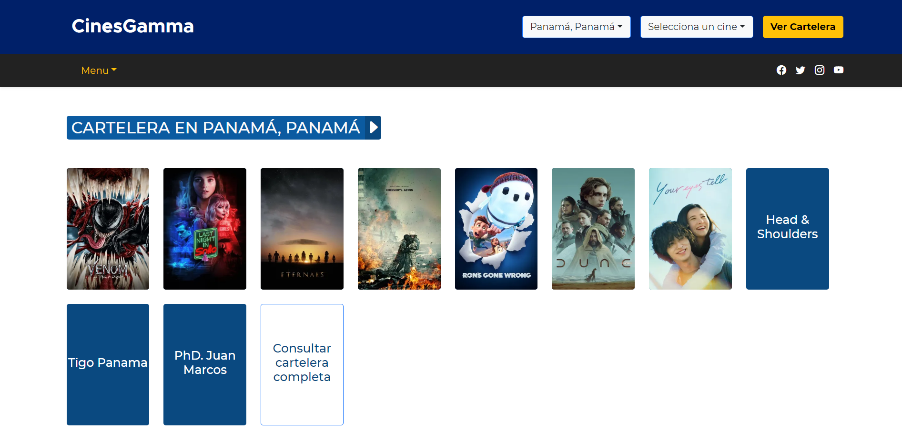

# CinesGamma App

Este proyecto es una progressive web app que utiliza ASP.NET con Javascript.

El proyecto fue creado a partir de la plantilla de ASP.NET Core with React.js y luego fue modificado para utilizar Next.js

Para correr la aplicacion ejecute los siguientes comandos simultaneamente:

- Primero en la carpeta ClientApp: npm run dev
- Segundo en la carpeta principal: dotnet run

[Ver aplicacion](https://cinesgamma.azurewebsites.net/)